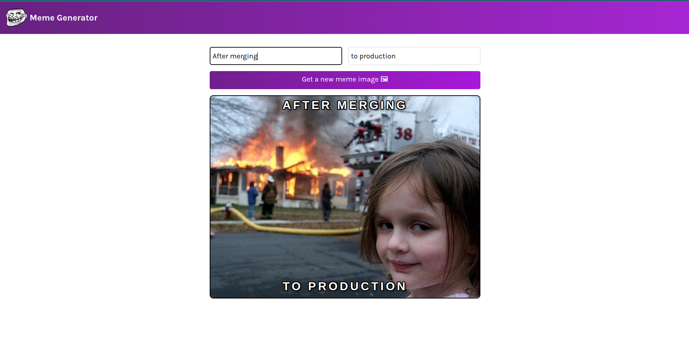

# Meme Generator

Generate random memes and add short captions to them.

## Preview

## Installation

1. Clone the repo and `cd` into it
2. Run `npm install` to install all required dependencies (this will create a /node_modules folder)
3. Then Run `npm start` to serve your project to localhost:3000
4. Enjoy
